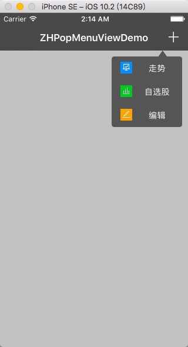

###ZHPopMenu
A easy and friendly way to make a popover view!


###Install
- Download ZHPopMenu
- Drag folder "Classes" into your project, make sure to ues "create group if need".
- import "ZHPopMenu.h"

###Useage

#####ZHPopMenuItem

- Create a ZHPopMenuItem

```
ZHPopMenuItem *item=[ZHPopMenuItem itemWithImage:image
title:titles[i]
titleColor:[UIColor whiteColor]
target:self
action:@selector(zh_menuItemAction:)];
```

#####ZHPopMenu
- Create a ZHPopMenu like tihs

```
-(ZHPopMenu *)menu{

if(!_menu){

NSMutableArray *items=[NSMutableArray array];
NSArray *titles=@[@"走势",@"自选股",@"编辑",@"音乐"];
for(int i=0;i<titles.count;i++){

NSString *imgageName=[NSString stringWithFormat:@"%d",i+1];
UIImage *image=[UIImage imageNamed:imgageName];
ZHPopMenuItem *item=[ZHPopMenuItem itemWithImage:image
title:titles[i]
titleColor:[UIColor whiteColor]
target:self
action:@selector(zh_menuItemAction:)];
[items addObject:item];
}
_menu=[ZHPopMenu menuWithFrame:CGRectMake(zh_width-130, 64, 120, 130)
items:items
arrowHeight:10
arrowPosition:CGPointMake(80, 0)];

_menu.rowHeight=40;
_menu.sperateInsets=UIEdgeInsetsMake(0, 10, 0, 10);
}
return _menu;
}
```
- How to show popover view

```
-(void)addBtnClickAction:(UIBarButtonItem *)sender{

if(self.menu.superview){//hide

[self zh_didmissMenu];

}else{//show

[self.view addSubview:self.back];
__weak typeof(self) wkself=self;
[self.back mas_makeConstraints:^(MASConstraintMaker *make) {

make.edges.equalTo(wkself.view);
}];
[self.view addSubview:self.menu];
[self.menu mas_makeConstraints:^(MASConstraintMaker *make) {

make.right.equalTo(wkself.view).offset(-10);
make.top.equalTo(wkself.view).offset(64);
make.size.mas_equalTo(CGSizeMake(120, 130));
}];
}
}
```

- Observer ZHPopMenuItem click action:

```
-(void)zh_menuItemAction:(ZHPopMenuItem *)sender{

NSString *title=[sender.title copy];
NSLog(@"You Clicked %@",title);
}
```

- Hide ZHPopMenu

```
-(void)zh_didmissMenu{

[self.back removeFromSuperview];
[self.menu removeFromSuperview];
}
```

### About 
-Homepage:[Babr2](https://github.com/Babr2) issue me please.
